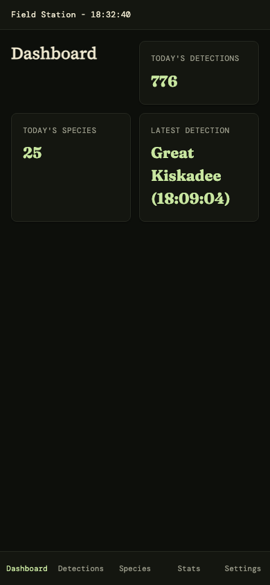

# FastHTML UI Deployment to BirdNET-Pi

*2026-02-26T00:33:45Z by Showboat 0.6.1*
<!-- showboat-id: 268795fd-d462-4bea-86ab-ac6c4f6d5eca -->

Successfully deployed FastHTML UI to BirdNET-Pi at 10.0.0.177:8502


**Steps completed:**
1. Changed git remote from Nachtzuster/BirdNET-Pi to knmurphy/BirdNET-Pi-old
2. Updated code to latest commit (21ddb34)
3. Installed pyenv + Python 3.12.12 (FastHTML requires Python 3.10+)
4. Installed FastHTML and dependencies
5. Started web app on port 8502

**Available routes:**
- /app/dashboard - Today's detections & species count
- /app/detections - Detection list with audio playback
- /app/species - Species list with counts
- /app/stats - Hourly activity chart + system health
- /app/settings - Placeholder

```bash {image}
/tmp/field-station-dashboard.png
```



```bash {image}
dev/field-station-dashboard.png
```


